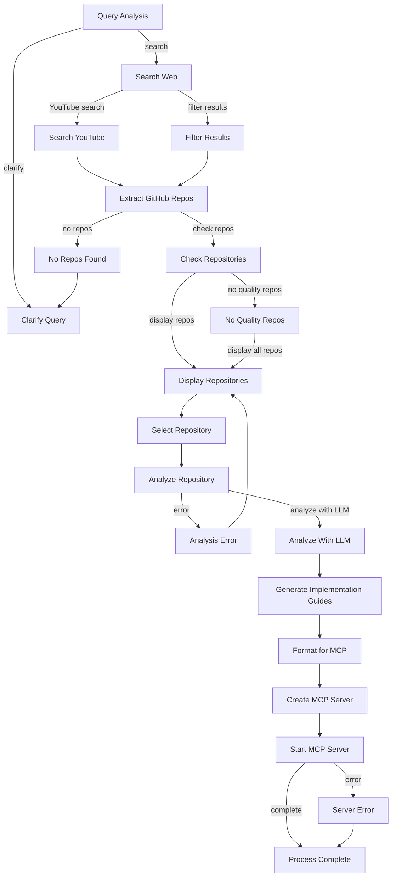

# GitHub Repository Finder Agent: Context and Architecture

## Overview
The GitHub Repository Finder is an agent built using the PocketFlow framework that searches for relevant GitHub repositories based on user queries. It uses both web search and YouTube search to find and extract GitHub URLs, focusing on repositories that match the user's requirements for technologies, keywords, and features.

## Key Files and Their Purposes

### Core System Files
1. `/home/vboxuser/Documents/mnt/PocketFlow/pocketflow/__init__.py`
   - The core PocketFlow framework (100-line minimalist LLM framework)
   - Provides Node, Flow, BatchNode, AsyncNode, and other core abstractions

2. `/home/vboxuser/Documents/mnt/PocketFlow/utils/search.py`
   - The main module we've been modifying
   - Handles web and YouTube searches, scraping, and GitHub URL extraction
   - Includes the LLM-enhanced repository search and quality assessment

3. `/home/vboxuser/Documents/mnt/PocketFlow/utils/github.py`
   - Contains utilities for extracting GitHub URLs from text content
   - Helps analyze GitHub repositories for complexity and size
   - Provides functionality to analyze repository contents

4. `/home/vboxuser/Documents/mnt/PocketFlow/utils/llm.py`
   - Provides the LLM utility functions
   - Used for search query refinement, content relevance evaluation, and more

5. `/home/vboxuser/Documents/mnt/PocketFlow/utils/monitoring.py`
   - Provides execution time logging for performance monitoring
   - Contains the `log_execution_time` decorator used in search functions
   - Tracks success rates and performance metrics for scraping operations

6. `/home/vboxuser/Documents/mnt/PocketFlow/utils/data_processing.py`
   - Handles data formatting and processing
   - Generates implementation guides from repository analysis
   - Formats repository lists for user selection

7. `/home/vboxuser/Documents/mnt/PocketFlow/utils/mcp.py`
   - MCP (Modular Computation Protocol) server utilities
   - Creates and manages MCP servers for repository analysis

8. `/home/vboxuser/Documents/mnt/PocketFlow/nodes.py`
   - Implements PocketFlow nodes specific to the repository finder
   - Includes SearchWebNode, SearchYouTubeNode, ExtractGitHubReposNode, etc.

9. `/home/vboxuser/Documents/mnt/PocketFlow/flow.py`
   - Defines the repository finder agent's workflow
   - Connects nodes into a complete flow for finding GitHub repositories

10. `/home/vboxuser/Documents/mnt/PocketFlow/main.py`
    - Entry point for the application
    - Initializes and runs the flow with the shared data store

11. `/home/vboxuser/Documents/mnt/PocketFlow/requirements.txt`
    - Lists all dependencies required by the agent:
      - pocketflow, openai, anthropic, google-generativeai
      - requests, pyyaml, python-dotenv
      - yt-dlp for YouTube search/scraping
      - Search-Engines-Scraper for web search
      - beautifulsoup4 for HTML parsing

### External Tools Integrated

1. **yt-dlp**
   - Used for YouTube video search and metadata extraction
   - Extracts video descriptions, comments, and other metadata
   - Helps find GitHub URLs mentioned in video descriptions or comments

2. **Search-Engines-Scraper**
   - Performs web searches across multiple search engines
   - Extracts search results including titles, URLs, and snippets
   - Used to find web pages that might contain GitHub URLs

3. **BeautifulSoup4**
   - Parses HTML content from web pages
   - Extracts links, code blocks, and other content
   - Helps identify GitHub URLs in web content

## Key Utility Functions in `search.py`

### Search Functions
- `search_web(query, max_results)`: Searches the web for information
- `search_youtube(query, max_results)`: Searches YouTube for relevant videos
- `search_and_scrape(query, ...)`: Combined search and scrape process

### Scraping Functions
- `scrape_webpage(url, max_retries)`: Scrapes content and extracts GitHub URLs from web pages
  - Includes retry mechanism with fixed 5-second delays between retries
  - Rotates through different user agents to reduce blocking
  - Returns scrape_failed=True when all retries fail
- `scrape_youtube_video(url)`: Extracts information from YouTube videos

### GitHub URL Extraction
- `extract_github_urls(text)`: Uses regex to extract GitHub repository URLs from text
- `extract_github_urls_with_llm(text)`: Uses LLM to identify GitHub URLs in ambiguous cases

### LLM-Enhanced Features
- `refine_search_query(query, keywords, tech_stack, features)`: Improves search queries
- `check_content_relevance_with_llm(content, query, keywords, tech_stack, features)`: Evaluates relevance
- `assess_repository_quality(url, query, features)`: Evaluates repository quality

## Repository Finder Agent Flow

1. **Initial Query Processing**
   - Takes user query with optional keywords, tech stack, and features
   - Refines the query using LLM if enabled

2. **Search Phase**
   - Performs web search (Google, Bing, etc.)
   - Performs YouTube search if enabled
   - Filters results based on relevance to the query

3. **Scraping Phase**
   - Scrapes relevant web pages and YouTube videos
   - Extracts GitHub URLs using regex and LLM-enhanced methods
   - Handles scraping errors with retry mechanism (2 retries with 5-second delays)
   - Reports failures and continues to next site when retries are exhausted

4. **Repository Evaluation**
   - Assesses repository quality if LLM is enabled
   - Ranks repositories by relevance and quality

5. **Result Presentation**
   - Returns a structured dictionary with all findings
   - Includes relevance scores, success metrics, and repository quality assessments
   - Reports scrape failure statistics 

## Key Design Characteristics

- **Modular Architecture**: Separate nodes for each major function
- **Error Handling**: Includes graceful retry and fallback mechanisms 
- **LLM Enhancement**: Optional AI-powered features to improve results
- **Flexible Configuration**: Supports various search configurations
- **Stateful Processing**: Maintains context throughout the flow
- **External Events**: User selection can influence the flow's path

## Retry Mechanism for Web Scraping

The system includes a robust retry mechanism for handling 403 Forbidden errors and other scraping failures:

1. **User Agent Rotation**: Different user agents are tried on each retry attempt to bypass simple blocks
2. **Fixed Delay**: 5-second fixed delay between retry attempts to avoid triggering rate limits
3. **Failure Tracking**: The system tracks and reports scraping failures
4. **Graceful Continuation**: If scraping fails for a site after all retries, the system skips to the next site

This implementation ensures the agent can handle common scraping challenges while maintaining a good user experience.

## Data Flow and Process

### 1. User Input Phase
- User provides a search query and optional filtering parameters:
  - Keywords for filtering
  - Technologies/frameworks (tech stack)
  - Desired features
  - Number of YouTube videos to analyze
  - Number of web pages to analyze

### 2. Search Phase
- **YouTube Search**:
  - Uses yt-dlp to search for relevant videos
  - Enhances query with keywords, tech stack, and features
  - Extracts video metadata including any GitHub URLs in descriptions

- **Web Search**:
  - Uses Search-Engines-Scraper to search across multiple engines
  - Enhances query with keywords, tech stack, and features
  - Collects search results with titles, URLs, and snippets

### 3. Content Relevance Analysis
- Analyzes search results for relevance to user's requirements
- Scores content based on:
  - Presence of GitHub URLs (40% weight)
  - Matching features (30% weight)
  - Matching tech stack (20% weight)
  - Matching keywords (10% weight)
- Filters out low-relevance content
- Tracks average relevance scores for reporting

### 4. Content Scraping
- For relevant YouTube videos:
  - Scrapes full video descriptions and comments
  - Extracts GitHub URLs and other repository references

- For relevant web pages:
  - Scrapes HTML content using requests and BeautifulSoup
  - Implements retry mechanism with 5-second delays between attempts
  - Handles 403 errors and other access restrictions gracefully
  - Rotates user agents to reduce blocking frequency
  - If final site cannot be scraped, generates LLM-based suggestions
  - Extracts links, code blocks, and GitHub URLs
  - Analyzes content for repository references

### 5. Result Presentation
- Displays YouTube results with GitHub URLs
- Displays web page results with GitHub URLs
- Shows total unique GitHub repositories found
- Reports scraping success rate and average relevance scores
- Lists all extracted GitHub URLs

## PocketFlow Pattern Implementation

The system follows these PocketFlow patterns:

1. **Node Pattern**:
   - Each task is encapsulated in a Node with prep-exec-post lifecycle
   - YouTube search, web search, and scraping are all handled by dedicated nodes

2. **BatchNode Pattern**:
   - Used to process multiple search results in parallel
   - Filters and analyzes search results batch-wise

3. **Workflow Pattern**:
   - Chains multiple nodes into a sequential pipeline
   - Connects query analysis → search → filtering → scraping → presentation

4. **MapReduce Pattern**:
   - Maps the search query to multiple sources (YouTube, web)
   - Reduces results by filtering and deduplicating GitHub URLs

5. **Utility Functions**:
   - External tools (yt-dlp, Search-Engines-Scraper) are wrapped as utilities
   - Clear separation between core logic and external tool integration
   - Robust error handling and retry mechanisms for reliability

## Future Enhancements

1. **Repository Analysis**:
   - In-depth analysis of found repositories
   - Code quality assessment, activity metrics, contributor analysis

2. **MCP Integration**:
   - Packaging analysis results into MCP servers
   - Providing implementation guides based on repository analysis

3. **Parallel Processing**:
   - Implementing AsyncParallelBatchNode for concurrent processing
   - Improving performance for large numbers of search results

4. **User Feedback**:
   - Adding user feedback loops for repository selection
   - Fine-tuning search based on user preferences

5. **Error Handling Enhancements**:
   - Add proxy support for sites that consistently block access
   - Further improve fallback content generation for blocked sites

## Detailed Flow Implementation

The agent's flow is defined in `/home/vboxuser/Documents/mnt/PocketFlow/flow.py` and follows a complex graph structure with multiple decision points and branching paths:

### Flow Components

1. **Query Analysis & Clarification**
   - Starts with `QueryAnalysisNode` that extracts keywords, tech stack, and features
   - If query lacks sufficient detail, branches to `ClarifyQueryNode` for additional user input
   - Otherwise, proceeds to search phase

2. **Search Phase (Parallel Paths)**
   - `SearchWebNode` for web search
   - `SearchYouTubeNode` for YouTube search
   - `FilterSearchResultsNode` to filter and analyze search results relevance

3. **Repository Extraction & Validation**
   - `ExtractGitHubReposNode` extracts GitHub URLs from all search results
   - If no repositories found, goes to `NoReposFoundNode` which leads to query clarification
   - `CheckRepositoriesNode` evaluates repository quality and complexity

4. **Repository Selection**
   - `DisplayRepositoriesNode` presents repositories to the user
   - `SelectRepositoryNode` handles user selection of a repository for analysis
   - If no quality repos, can show all repositories with `NoQualityReposNode`

5. **Analysis Phase**
   - `AnalyzeRepositoryNode` performs initial repository analysis
   - In case of error, `AnalysisErrorNode` handles graceful error recovery
   - `AnalyzeWithLLMNode` uses LLM to evaluate repository usefulness

6. **Results Generation**
   - `GenerateImplementationGuidesNode` creates implementation guides
   - `FormatForMCPNode` formats analysis for MCP server
   - `CreateMCPServerNode` and `StartMCPServerNode` create and start an MCP server

7. **Completion**
   - `ServerErrorNode` handles MCP server startup errors
   - `ProcessCompleteNode` presents final results to the user

### Flow Diagram

### Flow Execution Pattern

The flow follows a dynamic, adaptable execution pattern:
- Each node returns an "action" string from its `post()` method
- The action determines which node gets executed next
- Default transitions are provided for nodes that don't return specific actions
- External events (like user selection) can influence the flow's path
- Error handling includes graceful retry and fallback mechanisms 