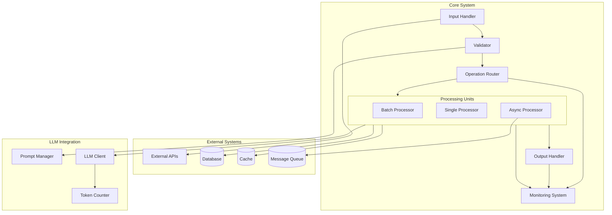
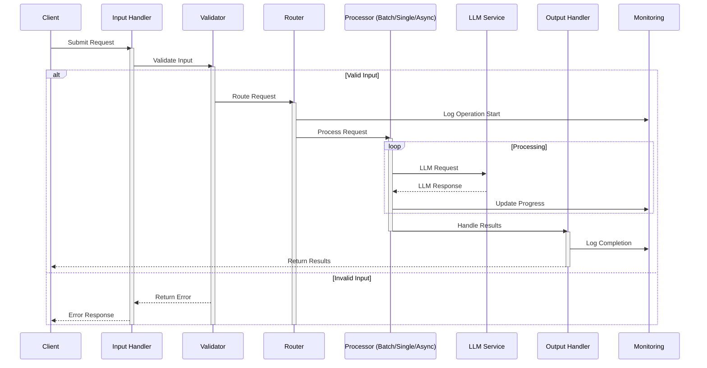
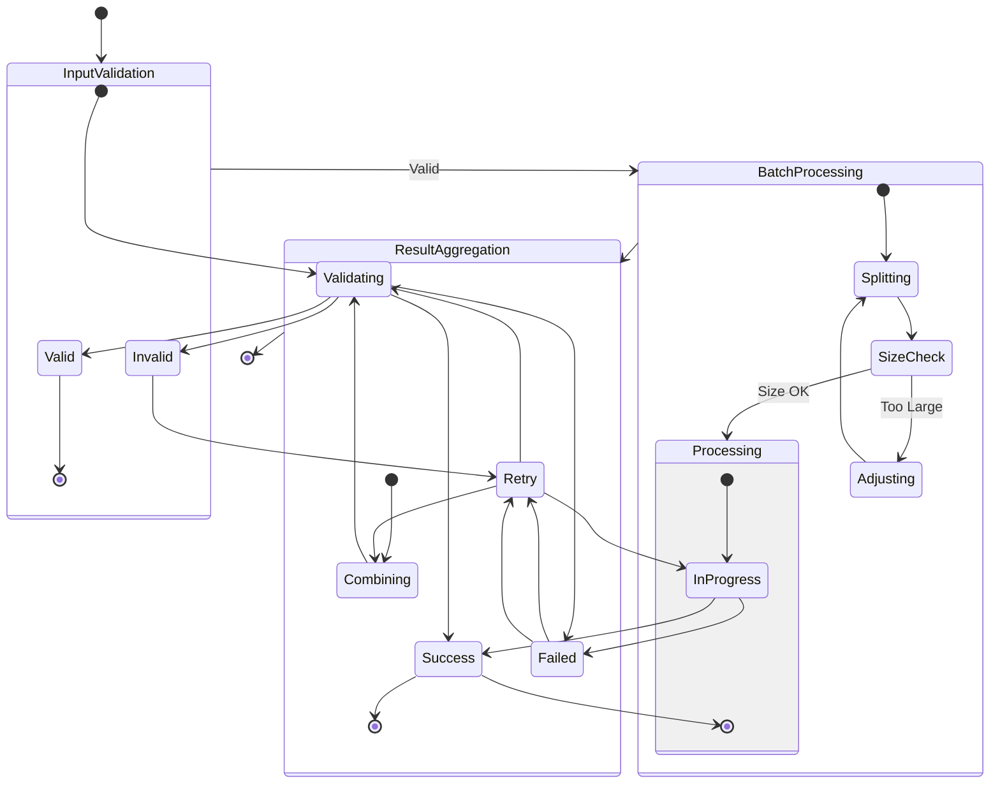
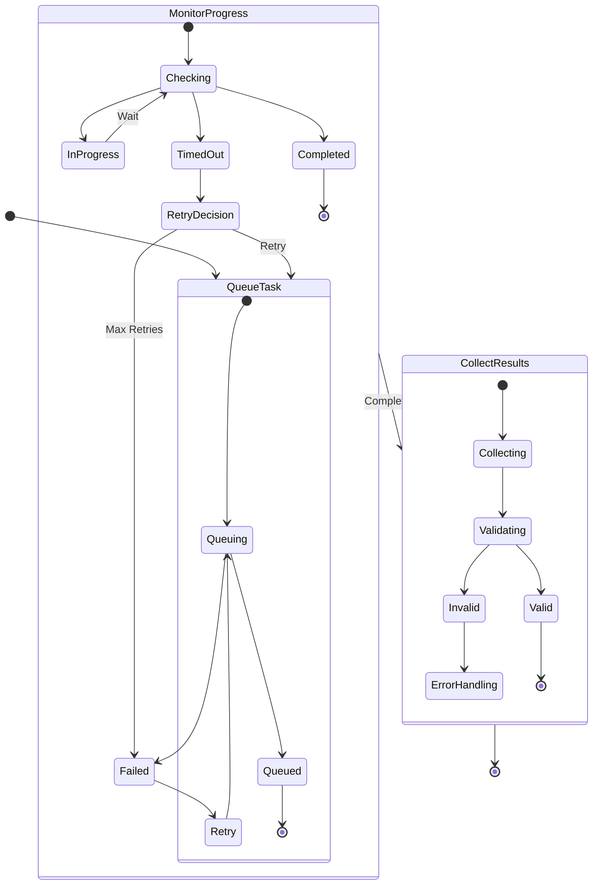
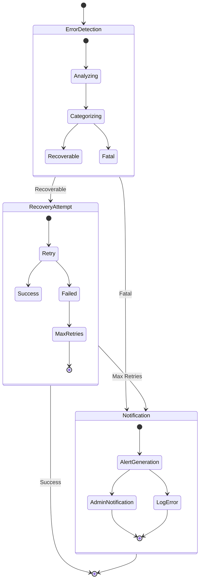
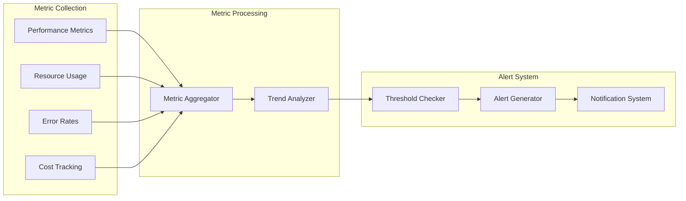
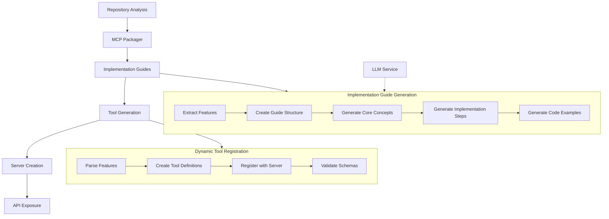

# PocketFlow Architecture Diagrams

## System Architecture Overview



## Component Interactions



## Batch Processing Flow



## Async Processing Flow



## Error Handling Flow



## Monitoring and Metrics Flow



## MCP Server Implementation Flow



### Implementation Guide Generation

**Purpose**: Creates structured AI-friendly implementation guides for repository features.

**Process Flow**:
1. **Extract Feature Details**: Parse repository analysis to identify key features
2. **Create Guide Structure**: Define structured JSON format for implementation guides
3. **Generate Core Concepts**: Identify fundamental principles behind each feature
4. **Map Implementation Steps**: Create step-by-step implementation instructions
5. **Define Class Structures**: Generate class definitions with attributes and methods
6. **Specify Method Details**: Define detailed method signatures with parameter descriptions
7. **Provide Integration Points**: Identify how features connect to the larger system

**Guide Components**:
- Core concepts and principles
- Dependencies and requirements
- Implementation steps with code examples
- Class and method specifications
- Integration points
- Testing approaches
- Agent-specific execution steps

**Feature-Specific Templates**:
- Flow implementation guides for orchestration features
- Node implementation guides for processing units
- Batch processing guides for parallel operations
- Utility function guides for helper components

### Tool Generation

**Purpose**: Creates MCP tool definitions from repository features and utilities.

**Process Flow**:
1. **Feature Extraction**: Extract features from repository analysis
2. **Tool Definition Creation**: Convert features to MCP tool definitions
3. **Schema Generation**: Create input/output schemas for each tool
4. **Documentation**: Generate comprehensive tool documentation
5. **Tool Registration**: Register tools with the MCP server

**Tool Categories**:
- Feature-specific tools for repository functionality
- Utility tools for common operations
- Implementation guide generators
- Repository exploration and navigation tools

**Tool Definition Structure**:
```
{
    "name": "tool_name",
    "description": "Comprehensive description",
    "inputSchema": {
        "type": "object",
        "properties": {...},
        "required": [...]
    },
    "outputSchema": {
        "type": "object",
        "properties": {...}
    }
}
```

### Server Creation

**Purpose**: Configures and initializes the MCP server with generated tools.

**Process Flow**:
1. **Server Initialization**: Create FastMCP server instance
2. **Base Tool Registration**: Register core tools for repository interaction
3. **Dynamic Tool Registration**: Register tools generated from repository analysis
4. **Configuration**: Set up server parameters (host, port, etc.)
5. **Error Handling**: Configure server-level error handling and logging

**Server Configuration Options**:
- Host and port settings
- Authentication options
- Rate limiting configuration
- Caching settings
- Logging and monitoring

**Dynamic Registration**:
The server dynamically registers tools based on repository analysis:
- Each feature in the repository becomes a tool
- Each utility function becomes a tool
- Implementation guides are exposed as tools
- Meta-tools for repository exploration are added

### API Exposure

**Purpose**: Exposes the MCP server through HTTP endpoints.

**Process Flow**:
1. **Endpoint Creation**: Define RESTful endpoints for tool access
2. **Documentation Generation**: Create OpenAPI specification
3. **Web Interface Setup**: Configure interactive documentation
4. **Authentication Layer**: Implement API key authentication
5. **Server Start**: Launch HTTP server on configured host/port

**Key Endpoints**:
- `/tools`: Lists all available tools
- `/tool/{tool_name}`: Executes a specific tool
- `/docs`: Interactive API documentation
- `/openapi.json`: OpenAPI specification
- `/status`: Server status and metrics

**Integration Patterns**:
- Direct HTTP API calls from external services
- Client library integration with language-specific SDKs
- Swagger UI for interactive testing
- AI agent integration through compatible clients 