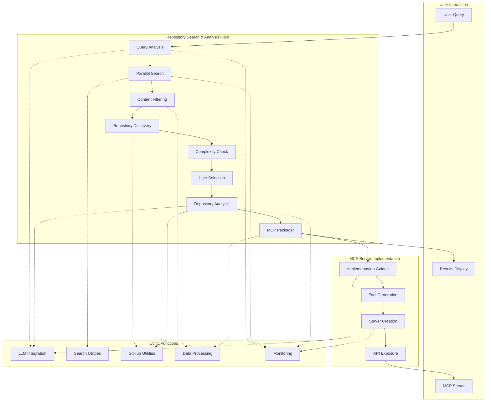

# Repository Analysis to MCP Server: Complete Architecture

## System Overview

This document describes the complete architecture of the Repository Search & Analysis system, which processes user queries to find relevant GitHub repositories, analyzes them in depth, and exposes their functionality through an MCP (Model Context Protocol) server.



## 1. Repository Search & Analysis Flow

### 1.1 Query Analysis Node

**Purpose**: Extracts keywords and context from the user's natural language query.

**Implementation**:
- **Type**: `Regular Node`
- **Prep**: Retrieves query string from shared store
- **Exec**: Uses LLM to extract keywords and intent from the query
- **Post**: Stores extracted keywords and context in shared store
- **Error Handling**: Returns "error" on failure, "search" on success

**Utility Dependencies**:
- `extract_keywords()`: LLM-based keyword extraction utility
- `log_execution_time()`: Performance monitoring decorator

**Shared Store Updates**:
```python
shared["query_analysis"] = exec_res
shared["original_query"] = exec_res.get("original_query", "")
shared["keywords"] = exec_res.get("keywords", [])
shared["context"] = exec_res.get("context", "")
```

### 1.2 Parallel Search Node

**Purpose**: Performs parallel searches on web and YouTube to find relevant content.

**Implementation**:
- **Type**: `BatchNode`
- **Prep**: Creates search configurations for web and YouTube
- **Exec**: Executes search for each configuration
- **Post**: Organizes search results by type in shared store
- **Error Handling**: Returns "no_results" if no results found, "filter" otherwise

**Utility Dependencies**:
- `search_web()`: Web search API client
- `search_youtube()`: YouTube search API client
- `log_execution_time()`: Performance monitoring decorator

**Batch Processing**:
- Creates two batch items: web search and YouTube search
- Processes them independently with different search APIs
- Combines results in the post method

**Shared Store Updates**:
```python
shared["web_results"] = [web_search_results]
shared["youtube_results"] = [youtube_search_results]
```

### 1.3 Filter Relevant Content Node

**Purpose**: Filters search results to identify strictly relevant content based on keywords and context.

**Implementation**:
- **Type**: `BatchNode`
- **Prep**: Combines web and YouTube results for processing
- **Exec**: Checks relevance of each result against keywords/context
- **Post**: Organizes strictly relevant results by type
- **Error Handling**: Returns "no_relevant_results" if no relevant content found

**Utility Dependencies**:
- `check_content_relevance()`: LLM-based content relevance checker
- `log_execution_time()`: Performance monitoring decorator

**Relevance Criteria**:
- Content must be 100% relevant to keywords or context
- Uses threshold-based filtering (threshold=1.0)
- LLM evaluates and justifies relevance decisions

**Shared Store Updates**:
```python
shared["relevant_articles"] = [filtered_articles]
shared["relevant_videos"] = [filtered_videos]
```

### 1.4 Find Repositories Node

**Purpose**: Extracts GitHub repository URLs from relevant content.

**Implementation**:
- **Type**: `BatchNode`
- **Prep**: Prepares articles and videos for processing
- **Exec**: Extracts GitHub URLs from each content item
- **Post**: Collects and deduplicates repositories
- **Error Handling**: Returns "no_repositories" if no repositories found

**Utility Dependencies**:
- `extract_github_urls()`: Pattern-matching utility for GitHub repositories
- `log_execution_time()`: Performance monitoring decorator

**Source Tracking**:
- Each repository is linked to its source (article or video)
- Preserves source title, URL, and content type

**Shared Store Updates**:
```python
shared["repositories"] = [unique_repositories]
```

### 1.5 Check Repository Complexity Node

**Purpose**: Evaluates repositories for complexity and implementation quality.

**Implementation**:
- **Type**: `BatchNode`
- **Prep**: Prepares repositories for complexity analysis
- **Exec**: Checks each repository for stars, issues, documentation
- **Post**: Filters repositories that meet quality criteria
- **Error Handling**: Returns "no_filtered_repositories" if no repositories meet criteria

**Utility Dependencies**:
- `check_repository_complexity()`: GitHub API client for repository metadata
- `log_execution_time()`: Performance monitoring decorator

**Complexity Metrics**:
- Star count (popularity)
- Active issues and PRs (maintenance)
- Documentation quality
- Recent activity

**Shared Store Updates**:
```python
shared["filtered_repositories"] = [quality_repositories]
```

### 1.6 User Selection Node

**Purpose**: Presents filtered repositories to user for selection.

**Implementation**:
- **Type**: `Regular Node`
- **Prep**: Retrieves filtered repositories from shared store
- **Exec**: Formats repositories for display and gets user selection
- **Post**: Stores selected repository in shared store
- **Error Handling**: Returns "no_selection" if user doesn't select a repository

**Utility Dependencies**:
- `format_repository_list()`: Text formatting utility
- `get_user_selection()`: User input handling utility

**User Interaction**:
- Displays numbered list of repositories with brief descriptions
- Accepts user input for selection
- Validates selection and handles invalid inputs

**Shared Store Updates**:
```python
shared["selected_repository"] = selected_repository
```

### 1.7 Deep Repository Analysis Node

**Purpose**: Performs in-depth analysis of the selected repository.

**Implementation**:
- **Type**: `Regular Node`
- **Prep**: Retrieves selected repository from shared store
- **Exec**: Analyzes repository structure, code, and documentation
- **Post**: Stores detailed analysis in shared store
- **Error Handling**: Returns "analysis_error" on failure

**Utility Dependencies**:
- `analyze_repository()`: GitHub API client for repository content
- `analyze_repository_with_llm()`: LLM-based code analysis
- `log_execution_time()`: Performance monitoring decorator

**Analysis Components**:
- Basic repository information
- Feature mapping
- Utility identification
- Implementation patterns
- Code quality assessment
- Documentation quality

**Shared Store Updates**:
```python
shared["repository_analysis"] = {
    "basic_analysis": basic_info,
    "detailed_analysis": detailed_analysis
}
```

### 1.8 MCP Packager Node

**Purpose**: Formats analysis results into MCP server package.

**Implementation**:
- **Type**: `Regular Node`
- **Prep**: Collects all data from shared store
- **Exec**: Creates MCP package with tools, implementation guides, and server config
- **Post**: Stores MCP package in shared store
- **Error Handling**: Returns "package_error" on failure

**Utility Dependencies**:
- `generate_implementation_guides_from_analysis()`: Implementation guide generator
- `format_for_mcp()`: MCP-specific data formatter

**MCP Package Structure**:
```python
mcp_package = {
    "name": f"{repo_name}-mcp",
    "version": "1.0.0",
    "description": f"MCP server for {repo_name} repository",
    "repository": repo_url,
    "server_info": {...},
    "tools": [...],
    "implementation_guides": {...},
    "metadata": {...}
}
```

**Shared Store Updates**:
```python
shared["mcp_package"] = mcp_package
```

## 2. MCP Server Implementation

### 2.1 Implementation Guide Generation

**Purpose**: Creates structured implementation guides for repository features.

**Implementation Details**:
- **Function**: `generate_structured_implementation_guide()`
- **Input**: Feature name, feature details, target language
- **Output**: Detailed implementation guide with steps, class structures, and methods

**Guide Components**:
1. **Core Concepts**: Fundamental principles behind the feature
2. **Dependencies**: Required libraries or components
3. **Implementation Steps**: Step-by-step instructions
4. **Class Structure**: Class definitions with attributes and methods
5. **Method Specifications**: Detailed method definitions with parameters and algorithms
6. **Agent Execution Steps**: AI-friendly steps for implementation

**Feature-Specific Templates**:
- **Flow Features**: Graph-based execution structure
- **Node Features**: Lifecycle methods and processing units
- **Batch Features**: Parallel processing patterns
- **Utility Features**: Helper function implementation

**Example Implementation Guide Structure**:
```python
implementation_guide = {
    "feature_name": feature_name,
    "description": description,
    "component_type": "feature",
    "source_location": location,
    "implementation": {
        "language": language,
        "core_concepts": [...],
        "dependencies": [...],
        "usage_pattern": usage_example,
        "implementation_steps": [...],
        "code_examples": [...],
        "class_structure": {...},
        "method_specifications": [...]
    },
    "integration_points": [...],
    "common_patterns": [...],
    "testing_approach": "",
    "agent_execution_steps": [...]
}
```

### 2.2 Tool Generation

**Purpose**: Creates MCP tool definitions from repository features and utilities.

**Implementation Details**:
- **Method**: Part of `MCPPackagerNode.exec()`
- **Input**: Repository analysis with features and utilities
- **Output**: Array of tool definitions in MCP format

**Tool Categories**:
1. **Feature Tools**: Access to repository features (get_feature_name)
2. **Utility Tools**: Access to repository utilities (use_utility_name)
3. **Implementation Tools**: Tools for generating implementation guides
4. **Repository Tools**: Tools for repository overview and search

**Tool Definition Structure**:
```python
tool = {
    "name": tool_name,
    "description": description,
    "inputSchema": {
        "type": "object",
        "properties": {...},
        "required": [...]
    },
    "feature_type": feature_type
}
```

**Dynamic Tool Generation Process**:
1. Extract features from repository analysis
2. Convert each feature to a tool definition
3. Extract utilities from repository analysis
4. Convert each utility to a tool definition
5. Add standard tools (implementation guides, repository overview)
6. Include metadata and schemas for each tool

### 2.3 Server Creation

**Purpose**: Creates and configures the MCP server with defined tools.

**Implementation Details**:
- **Function**: `create_mcp_server()`
- **Input**: Server name and optional MCP package
- **Output**: Configured FastMCP server instance

**Server Configuration**:
- Server name and description
- Host and port settings
- Tool registration
- Error handling setup
- Logging configuration

**Core Server Functions**:
```python
def create_mcp_server(name: str = "Repository Search & Analysis MCP Server") -> FastMCP:
    # Create a named server
    mcp = FastMCP(name)
    
    # Register tools
    @mcp.tool()
    def analyze_user_query(query: str) -> Dict[str, Any]:
        # Implementation...
    
    @mcp.tool()
    def search_web_content(search_query: str, max_results: int = 10) -> List[Dict[str, Any]]:
        # Implementation...
    
    # Additional tools...
    
    return mcp
```

**Dynamic Tool Registration**:
```python
def register_tools_from_repository_analysis(mcp: FastMCP, analysis: Dict[str, Any]) -> None:
    # Extract features and utilities
    features = analysis.get("detailed_analysis", {}).get("feature_map", {})
    utilities = analysis.get("detailed_analysis", {}).get("utilities", [])
    
    # Register feature tools
    for feature_name, feature_details in features.items():
        @mcp.tool(name=f"get_{feature_name.lower().replace(' ', '_')}")
        def get_feature_info():
            return feature_details
    
    # Register utility tools
    for utility in utilities:
        utility_name = utility.get("name", "unknown")
        @mcp.tool(name=f"use_{utility_name.lower().replace(' ', '_')}")
        def get_utility_info():
            return utility
```

### 2.4 API Exposure

**Purpose**: Starts the MCP server and exposes the API endpoints.

**Implementation Details**:
- **Function**: `start_server()`
- **Input**: Host, port, and optional MCP package path
- **Output**: Running MCP server with exposed endpoints

**Server Startup Process**:
```python
def start_server(
    host: str = "localhost", 
    port: int = 8000, 
    mcp_package_path: Optional[str] = None
) -> None:
    # Load MCP package if provided
    if mcp_package_path and os.path.exists(mcp_package_path):
        mcp_package = load_mcp_package(mcp_package_path)
        mcp = create_mcp_server(mcp_package.get("name", "Repository MCP Server"))
        register_tools_from_repository_analysis(mcp, mcp_package)
    else:
        mcp = create_mcp_server()
    
    # Start the server
    mcp.run(host=host, port=port)
```

**API Endpoints**:
- `/tools`: Lists available tools
- `/tool/{tool_name}`: Executes a specific tool
- `/openapi.json`: OpenAPI specification
- `/docs`: Interactive API documentation

## 3. Utility Functions

### 3.1 LLM Integration Utilities

**Purpose**: Provides access to language models for text analysis and generation.

**Key Functions**:
- `call_llm(prompt, model=None, provider=None, temperature=0.1, max_tokens=1500)`: Core LLM calling function
- `stream_llm(prompt, callback=None, ...)`: Streaming version for incremental responses
- `analyze_repository_with_llm(repo_data, keywords, context)`: Repository-specific LLM analysis

**Provider Support**:
- OpenAI (gpt-4, gpt-3.5-turbo)
- Anthropic (claude-2)
- Fallback mechanisms

**Implementation Features**:
- Caching for efficiency
- Rate limit handling with retry logic
- Timeout management
- Response parsing for structured outputs

### 3.2 Search Utilities

**Purpose**: Provides access to external search APIs.

**Key Functions**:
- `search_web(query, max_results=10)`: Web search implementation
- `search_youtube(query, max_results=5)`: YouTube search implementation

**Implementation Features**:
- Result formatting and normalization
- Error handling for API failures
- Rate limiting compliance
- Result caching for efficiency

### 3.3 GitHub Utilities

**Purpose**: Provides access to GitHub API for repository analysis.

**Key Functions**:
- `extract_github_urls(content)`: Extracts GitHub URLs from text
- `check_repository_complexity(repo_url, min_stars=10)`: Evaluates repository quality metrics
- `analyze_repository(repo_url)`: Comprehensive repository data extraction

**Implementation Features**:
- GitHub API authentication
- Rate limit handling
- Content parsing for repository structure
- Code quality metrics calculation

### 3.4 Data Processing Utilities

**Purpose**: Transforms and formats data throughout the pipeline.

**Key Functions**:
- `extract_keywords(query)`: Extracts keywords from user queries
- `check_content_relevance(content, keywords, context, threshold=1.0)`: Evaluates content relevance
- `format_for_mcp(data)`: Formats data for MCP server
- `enhanced_format_for_mcp(data)`: Enhanced MCP formatting with implementation guides

**Implementation Features**:
- Text normalization and cleaning
- Structured format conversion (JSON, YAML)
- Schema validation
- LLM-based validation for complex structures

### 3.5 Monitoring Utilities

**Purpose**: Provides logging, performance tracking, and error handling.

**Key Functions**:
- `log_execution_time(operation_name)`: Decorator for timing operations
- `configure_logging(level, format_string)`: Sets up structured logging
- `increment_counter(name, value=1, tags=None)`: Metric tracking

**Implementation Features**:
- Structured logging with context
- Performance metric collection
- Error aggregation and reporting
- Execution visualization

## 4. MCP Server Interactions

### 4.1 Client Usage Pattern

```python
# Example client code for interacting with the MCP server
from fastmcp import MCPClient

# Connect to the server
client = MCPClient("http://localhost:8000")

# List available tools
tools = client.list_tools()
print(f"Available tools: {len(tools)}")

# Analyze a query
result = client.call_tool("analyze_user_query", {"query": "How to implement a workflow system in Python"})

# Search for relevant repositories
repos = client.call_tool("find_github_repositories", {"content": "Check out this workflow library at https://github.com/example/workflow"})

# Generate an implementation guide
guide = client.call_tool("generate_implementation_guide", {"feature_name": "Flow", "target_language": "Python"})
```

### 4.2 Web Interface

The MCP server provides a web interface at `/docs` with:
- Interactive documentation of all tools
- Request builder for testing tools
- Response visualization
- Authentication management

### 4.3 Integration Patterns

**AI Agent Integration**:
```python
def agent_function():
    # Connect to MCP server
    mcp_client = MCPClient("http://localhost:8000")
    
    # Process user query
    user_query = "How do I implement a workflow system?"
    
    # Analyze query
    analysis = mcp_client.call_tool("analyze_user_query", {"query": user_query})
    
    # Search for relevant content
    web_results = mcp_client.call_tool("search_web_content", {"search_query": analysis["context"]})
    
    # Find repositories
    repos = []
    for result in web_results:
        repos.extend(mcp_client.call_tool("find_github_repositories", {"content": result["snippet"]}))
    
    # Get implementation guide for a feature
    if repos:
        repo_url = repos[0]["url"]
        analysis = mcp_client.call_tool("analyze_github_repository", {
            "repo_url": repo_url,
            "keywords": analysis["keywords"],
            "context": analysis["context"]
        })
        
        # Get implementation guide for workflow feature
        guide = mcp_client.call_tool("generate_implementation_guide", {
            "feature_name": "Flow",
            "target_language": "Python"
        })
        
        return guide
    
    return "No suitable repositories found"
```

## 5. Reliability and Error Handling

### 5.1 Node-Level Error Handling

Each node implements comprehensive error handling:
- `max_retries` configuration for automatic retries
- `wait` time between retries
- `exec_fallback` method for graceful degradation
- Specific error actions that route to error handlers

### 5.2 Error Handler Node

**Purpose**: Handles errors from any node in the flow.

**Implementation**:
- **Type**: `Regular Node`
- **Prep**: Retrieves error context from shared store
- **Exec**: Decides whether to retry or fail based on error type
- **Post**: Routes flow based on decision (retry or fail)

**Error Processing Logic**:
- Categorizes errors as recoverable or fatal
- Implements backoff strategy for retries
- Preserves error context for debugging
- Provides meaningful error messages

### 5.3 Notify Admin Node

**Purpose**: Notifies administrators of fatal errors.

**Implementation**:
- **Type**: `Regular Node`
- **Prep**: Collects error details from shared store
- **Exec**: Formats and sends notification
- **Post**: Records notification in shared store

**Notification Channels**:
- Email notifications
- Slack/Teams integration
- Logging to monitoring systems
- Alert generation

## 6. Performance Optimization

### 6.1 Caching Strategies

- In-memory LRU cache for LLM calls
- Repository metadata caching
- Search result caching
- Implementation guide caching

### 6.2 Parallel Processing

- BatchNode for parallel search operations
- Concurrent repository analysis
- Async API calls with proper rate limiting

### 6.3 Resource Management

- Connection pooling for external APIs
- Timeout management for long-running operations
- Memory efficient data structures
- Resource cleanup

## Conclusion

This architecture demonstrates a comprehensive system that transforms a user query into a fully functional MCP server with dynamically generated tools and implementation guides. The system follows PocketFlow patterns while extending them with advanced MCP integration capabilities.

The key innovations are:
1. The seamless progression from search to analysis to MCP server creation
2. Highly structured implementation guides designed for AI agent consumption
3. Dynamic tool generation based on repository analysis
4. Comprehensive error handling and reliability features

This system enables AI agents to not only find relevant code repositories but also understand and implement their features through the structured guides and tools exposed via the MCP server. 